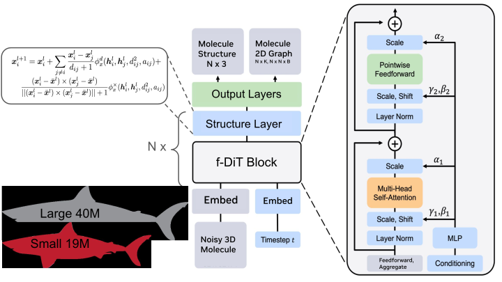

# Megalodon: Applications of Modular Co-Design for De Novo 3D Molecule Generation

<div align="center">
  <a href="https://dreidenbach.github.io/" target="_blank">Danny&nbsp;Reidenbach<sup>*</sup></a> &emsp; <b>&middot;</b> &emsp;
  <a href="https://scholar.google.com/citations?user=DOljaG8AAAAJ&hl=en" target="_blank">Filipp&nbsp;Nikitin<sup>*†</sup></a> &emsp; <b>&middot;</b> &emsp;
  <a href="https://olexandrisayev.com/" target="_blank">Olexandr&nbsp;Isayev</a> &emsp; <b>&middot;</b> &emsp;
  <a href="https://scholar.google.ch/citations?user=8S0VfjoAAAAJ&hl=en" target="_blank">Saee&nbsp;Paliwal</a>
  <br>
  <sup>*</sup>NVIDIA &emsp; <b>&middot;</b> &emsp; Department of Computational Biology, Carnegie Mellon University
  <br>
  Department of Chemistry, Carnegie Mellon University
  <br><br>
  <a href="https://arxiv.org/pdf/2505.18392" target="_blank">📄&nbsp;Paper</a> &emsp; <b>&middot;</b> &emsp;
  <a href="#citation">📖&nbsp;Citation</a> &emsp; <b>&middot;</b> &emsp;
  <a href="#setup">⚙️&nbsp;Setup</a>
  <br><br>
  <span><sup>*</sup>Equal contributions</span> &emsp; <span><sup>†</sup>Work performed during internship at NVIDIA</span>
</div>

---

## Overview

<div align="center">
    
</div>

### Abstract

De novo 3D molecule generation is a pivotal task in drug discovery. However, many recent geometric generative models struggle to produce high-quality 3D structures, even if they maintain 2D validity and topological stability. To tackle this issue and enhance the learning of effective molecular generation dynamics, we present **Megalodon**—a family of scalable transformer models. These models are enhanced with basic equivariant layers and trained using a joint continuous and discrete denoising co-design objective. 

We assess Megalodon's performance on established molecule generation benchmarks and introduce new 3D structure benchmarks that evaluate a model's capability to generate realistic molecular structures, particularly focusing on energetics. We show that Megalodon achieves state-of-the-art results in 3D molecule generation, conditional structure generation, and structure energy benchmarks using diffusion and flow matching. Furthermore, doubling the number of parameters in Megalodon to 40M significantly enhances its performance, generating up to 49x more valid large molecules and achieving energy levels that are 2-10x lower than those of the best prior generative models.

---

## Setup

### Prerequisites

- Python 3.10+
- CUDA-compatible GPU (recommended for training)
- [Conda](https://docs.conda.io/) or [Mamba](https://mamba.readthedocs.io/) (recommended)

### Environment Setup

```bash
# Clone the repository
git clone [repository-url]
cd megalodon

# Create and activate conda environment
conda create -n megalodon python=3.10 -y
conda activate megalodon

# Install dependencies
pip install -e .
pip install -r requirements.txt
```

### Data Setup

The training and evaluation require the **GEOM-Drugs** and **QM9** datasets. 

For data downloading and preprocessing instructions, please refer to the `data_processing` directory.

---

## Usage

Make sure that `src` content is available in your `PYTHONPATH` (e.g., `export PYTHONPATH="./src:$PYTHONPATH"`) if megalodon is not installed locally (pip install -e .). 

### Model Training

**QM9 Dataset:**
```bash
# Megalodon diffusion model
python scripts/train.py --config-name=megalodon_diffusion train.gpus=2 data.dataset_root="./qm9_data"

# Megalodon flow matching model  
python scripts/train.py --config-name=megalodon_fm train.gpus=2 data.dataset_root="./qm9_data"

# Quick diffusion model (reduced timesteps)
python scripts/train.py --config-name=megalodon_quick_diffusion train.gpus=2 data.dataset_root="./qm9_data"
```

**GEOM-Drugs Dataset:**
```bash
# Megalodon diffusion model
python scripts/train.py --config-path=scripts/conf/drugs --config-name=megalodon_diffusion train.gpus=2 data.dataset_root="./drugs_data"

# Megalodon flow matching model
python scripts/train.py --config-path=scripts/conf/drugs --config-name=megalodon_fm train.gpus=2 data.dataset_root="./drugs_data"

# Quick diffusion model
python scripts/train.py --config-path=scripts/conf/drugs --config-name=megalodon_quick_diffusion train.gpus=2 data.dataset_root="./drugs_data"
```

### Training Configuration

You can easily override configuration parameters:

```bash
# Customize training parameters
python scripts/train.py --config-name=megalodon_diffusion \
    train.gpus=4 \
    train.n_epochs=300 \
    train.seed=42 \
    data.batch_size=64 \
    optimizer.lr=0.0005
```

### Model Inference and Sampling

#### Available Model Configurations

**QM9 Models:**
- `megalodon_diffusion.yaml` - Megalodon with diffusion objective - [download weights](https://catalog.ngc.nvidia.com/orgs/nvidia/teams/clara/resources/megalodon_qm9_large/files)
- `megalodon_fm.yaml` - Megalodon with flow matching objective - [download weights](https://catalog.ngc.nvidia.com/orgs/nvidia/teams/clara/resources/megalodon_qm9_fm/files)
- `megalodon_quick_diffusion.yaml` - Megalodon with lighter architecture - [download weights](https://catalog.ngc.nvidia.com/orgs/nvidia/teams/clara/resources/megalodon_qm9_quick/files)

**GEOM-Drugs Models:**
- `megalodon_diffusion.yaml` - Megalodon diffusion for drug-like molecules - [download weights](https://catalog.ngc.nvidia.com/orgs/nvidia/teams/clara/resources/megalodon_drugs_large/files)
- `megalodon_quick_diffusion.yaml` - Megalodon with lighter architecture - [download weights](https://catalog.ngc.nvidia.com/orgs/nvidia/teams/clara/resources/megalodon_drugs_small/files)
- `megalodon_fm.yaml` - Megalodon flow matching for drug-like molecules - [download weights](https://catalog.ngc.nvidia.com/orgs/nvidia/teams/clara/resources/megalodon_drugs_fm/files)

#### Sampling and Evaluation Commands
Make sure that `data.dataset_root` leads to a processed dataset directory, as sampling and evaluation require some of the statistics from the data. 
```bash
# Generate molecules using trained model
python scripts/sample.py --config_path scripts/conf/drugs/megalodon_diffusion.yaml --ckpt_path ckpts/drugs/megalodon_large_diffusion.ckpt --timesteps 500 --n_graphs 10
```

> **Note**: The MegalodonFlow model for GEOM-Drugs was originally trained in the Semla codebase and later transferred to this framework. A special configuration `megalodon_fm_inference` is provided specifically for the `drugs/megalodon_fm.ckpt` checkpoint to ensure compatibility.

```bash
# Example: Using the special inference config for transferred MegalodonFlow model
python scripts/sample.py --config_path scripts/conf/drugs/megalodon_fm_inference.yaml --ckpt_path ckpts/drugs/megalodon_fm.ckpt --timesteps 100 --n_graphs 10
```

Upon completion of the sampling process, comprehensive evaluation metrics will be automatically calculated and displayed in the terminal output.

For advanced energy evaluation using the **GFN2-xTB energy benchmark**, please refer to the dedicated evaluation repository [geom-drugs-3dgen-evaluation](https://github.com/isayevlab/geom-drugs-3dgen-evaluation).

---

## Citation

If you use Megalodon in your research, please cite our paper:

```bibtex
@article{reidenbach2025applications,
  title={Applications of Modular Co-Design for De Novo 3D Molecule Generation},
  author={Reidenbach, Danny and Nikitin, Filipp and Isayev, Olexandr and Paliwal, Saee},
  journal={arXiv preprint arXiv:2505.18392},
  year={2025}
}
```