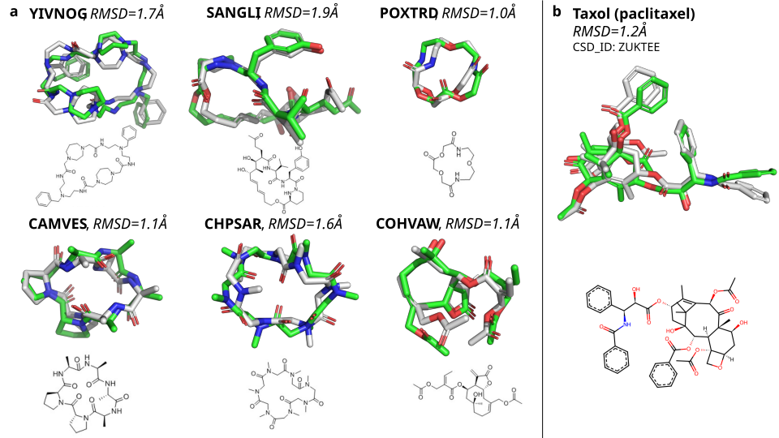

# LoQI: Scalable Low-Energy Molecular Conformer Generation with Quantum Mechanical Accuracy

<div align="center">
  <a href="https://scholar.google.com/citations?user=DOljaG8AAAAJ&hl=en" target="_blank">Filipp&nbsp;Nikitin<sup>1,2</sup></a> &emsp; <b>&middot;</b> &emsp;
  <a href="#" target="_blank">Dylan&nbsp;M.&nbsp;Anstine<sup>2,3</sup></a> &emsp; <b>&middot;</b> &emsp;
  <a href="#" target="_blank">Roman&nbsp;Zubatyuk<sup>2,5</sup></a> &emsp; <b>&middot;</b> &emsp;
  <a href="https://scholar.google.ch/citations?user=8S0VfjoAAAAJ&hl=en" target="_blank">Saee&nbsp;Gopal&nbsp;Paliwal<sup>5</sup></a> &emsp; <b>&middot;</b> &emsp;
  <a href="https://olexandrisayev.com/" target="_blank">Olexandr&nbsp;Isayev<sup>1,2,4*</sup></a>
  <br>
  <sup>1</sup>Ray and Stephanie Lane Computational Biology Department, Carnegie Mellon University, Pittsburgh, PA, USA
  <br>
  <sup>2</sup>Department of Chemistry, Carnegie Mellon University, Pittsburgh, PA, USA
  <br>
  <sup>3</sup>Department of Chemical Engineering and Materials Science, Michigan State University, East Lansing, MI, USA
  <br>
  <sup>4</sup>Department of Materials Science and Engineering, Carnegie Mellon University, Pittsburgh, PA, USA
  <br>
  <sup>5</sup>NVIDIA, Santa Clara, CA, USA
  <br><br>
  <a href="#" target="_blank">📄&nbsp;Paper</a> &emsp; <b>&middot;</b> &emsp;
  <a href="#citation">📖&nbsp;Citation</a> &emsp; <b>&middot;</b> &emsp;
  <a href="#setup">⚙️&nbsp;Setup</a> &emsp; <b>&middot;</b> &emsp;
  <a href="https://github.com/isayevlab/LoQI" target="_blank">🔗&nbsp;GitHub</a>
  <br><br>
  <span><sup>*</sup>Corresponding author: olexandr@olexandrisayev.com</span>
</div>

---

## Overview

<div align="center">
    
</div>

### Abstract

Molecular geometry is crucial for biological activity and chemical reactivity; however, computational methods for generating 3D structures are limited by the vast scale of conformational space and the complexities of stereochemistry. Here we present an approach that combines an expansive dataset of molecular conformers with generative diffusion models to address this problem. We introduce **ChEMBL3D**, which contains over 250 million molecular geometries for 1.8 million drug-like compounds, optimized using AIMNet2 neural network potentials to a near-quantum mechanical accuracy with implicit solvent effects included. This dataset captures complex organic molecules in various protonation states and stereochemical configurations. 

We then developed **LoQI** (Low-energy QM Informed conformer generative model), a stereochemistry-aware diffusion model that learns molecular geometry distributions directly from this data. Through graph augmentation, LoQI accurately generates molecular structures with targeted stereochemistry, representing a significant advance in modeling capabilities over previous generative methods. The model outperforms traditional approaches, achieving up to tenfold improvement in energy accuracy and effective recovery of optimal conformations. Benchmark tests on complex systems, including macrocycles and flexible molecules, as well as validation with crystal structures, show LoQI can perform low energy conformer search efficiently.

> **Note on Implementation**: LoQI is built upon the [Megalodon architecture](https://arxiv.org/pdf/2505.18392) developed, adapting it specifically for stereochemistry-aware conformer generation with the ChEMBL3D dataset.

---

## Key Features

- **ChEMBL3D Dataset**: 250+ million AIMNet2-optimized conformers for 1.8M drug-like molecules
- **Stereochemistry-Aware**: First all-atom diffusion model with explicit stereochemical encoding
- **Quantum Mechanical Accuracy**: Near-DFT accuracy with implicit solvent effects
- **Superior Performance**: Up to 10x improvement in energy accuracy over traditional methods
- **Complex Molecule Support**: Handles macrocycles, flexible molecules, and challenging stereochemistry

---

## Setup

### System and Hardware Requirements

- OS tested by authors:
  - Ubuntu 24.04 LTS (latest stable Ubuntu LTS at time of writing)
- Other platforms:
  - Expected to work: only `torch` and the pure-Python `torch_geometric` are required, no compiled
    PyTorch Geometric extensions.
- Tested inference hardware:
  - GPU: NVIDIA RTX 3090 (24 GB VRAM)
  - CPU: AMD Ryzen 9 5950X
- Recommended GPU memory:
  - 16-24 GB VRAM for comfortable inference/evaluation with larger molecules and higher batch sizes
- Minimum practical GPU memory:
  - 8 GB VRAM can run inference, but requires reduced batch sizes
- CPU-only:
  - Works (the package tests run on CPU, see [Environment](#environment)) but is slow for large
    molecules or many conformers and was not systematically studied by the authors

OOM mitigation for larger molecules:
- reduce inference batch size (`--batch_size` in sampling, or `data.inference_batch_size` in config)
- if using evaluation/optimization, also reduce optimization batch size (`evaluation.energy_metrics_args.batchsize`)

### Installation

LoQI is a regular Python package (distribution `loqi`, import packages `loqi` and `megalodon`).
It needs Python 3.11+ and PyTorch >= 2.8; no compiled PyTorch Geometric extensions
(`torch_scatter`, `torch_sparse`, `pyg_lib`) are required. Install from GitHub with uv or pip
(publication on PyPI is a later step):

```bash
uv pip install "loqi @ git+https://github.com/isayevlab/LoQI"
# or
pip install "loqi @ git+https://github.com/isayevlab/LoQI"
```

For a CUDA build of PyTorch install `torch` first from the matching PyTorch index, e.g.
`pip install torch --index-url https://download.pytorch.org/whl/cu128`, then install `loqi`.

Development install from a clone:

```bash
git clone https://github.com/isayevlab/LoQI.git
cd LoQI
uv venv && source .venv/bin/activate
uv pip install -e ".[dev]"     # inference dependencies + pytest and ruff
uv pip install -e ".[train]"   # adds hydra-core, wandb, zarr, h5py, pandas for training and preprocessing
```

Extras: `train` (training and dataset preprocessing), `aimnet` (the `aimnet` package for the
AIMNet2 potential), `dev` (pytest, ruff). `requirements.txt` mirrors the inference floors for
tools that consume requirements files.

### Quick start

```python
from loqi import generate_conformers

mols = generate_conformers(["CCO", "CC(=O)Oc1ccccc1C(=O)O"], n_conformers=10, device="cpu")
for mol in mols:  # RDKit molecules with explicit hydrogens, one per input SMILES
    print(mol.GetNumConformers(), "conformers,", mol.GetIntProp("loqi_failed"), "failed samples")
```

`generate_conformers(smiles, n_conformers=10, *, model="loqi", device=None, seed=42, steps=None,
add_hs=True, batch_atoms=None)` returns one molecule per input SMILES with up to `n_conformers`
conformers (ids `0..k-1`); samples with non-finite coordinates are dropped and counted in the
integer property `loqi_failed`. `model` is `"loqi"` (diffusion), `"loqi_flow"` (flow matching), a
checkpoint path, or a `LoadedModel` from `load_model(...)`; re-use a `LoadedModel` when calling
repeatedly. Invalid SMILES (parse errors, unsupported elements, radicals) raise `ValueError` before
any sampling. `steps` defaults to the training value (25; the diffusion model should be run with 25
steps, the flow-matching model tolerates other counts). `batch_atoms` bounds memory: it is the atom
budget of a sampling batch at the 50-atom reference size (default 7500 from the config, tuned for a
24 GB GPU); lower it on CPU or small GPUs. The API never runs AIMNet2 or any geometry optimisation.

```python
from loqi import load_model, generate_conformers

model = load_model("loqi_flow", device="cuda")            # downloaded and verified on first use
mols = generate_conformers("c1ccncc1", 50, model=model, seed=0, batch_atoms=2000)
```

Command line:

```bash
loqi download --model loqi                               # fetch and verify the checkpoint once
loqi sample --smiles "CCO" --smiles "CC(=O)Oc1ccccc1C(=O)O" --n-confs 10 --output confs.sdf
loqi sample --input molecules.smi --n-confs 20 --model loqi_flow --device cuda --seed 0 --output confs.sdf
```

`loqi sample` writes one SDF record per conformer with the input SMILES as title and the
properties `loqi_model` and `loqi_conformer_id`; invalid SMILES are reported and skipped.
`--steps`, `--batch-atoms` and `--no-add-hs` map to the API arguments above.

### Checkpoints

Registered models (`loqi.MODELS`) are downloaded on first use from the KiltHub record
[doi:10.1184/R1/31441570](https://doi.org/10.1184/R1/31441570) (checkpoints are MIT licensed),
verified by SHA-256 and cached as `$LOQI_CACHE_DIR/<name>.ckpt` or `~/.cache/loqi/<name>.ckpt`
(about 360 MB each). `load_model("/path/to/checkpoint.ckpt", config="loqi.yaml")` loads a local
checkpoint; the inference configs `loqi.yaml` and `loqi_flow.yaml` are bundled in `loqi/configs`.

### Environment

Verified on CPU (Linux x86-64 under WSL2) with Python 3.12, torch 2.14.0+cpu,
torch-geometric 2.8.0.post1, rdkit 2026.3.5, lightning 2.6.5, omegaconf 2.3.1, einops 0.8.2,
numpy 2.5.2, scipy 1.18.1 and tqdm 4.70.0. No compiled PyTorch Geometric extensions
(`torch_scatter`, `torch_sparse`, `pyg_lib`) are installed or needed: `megalodon.scatter` provides
the `torch_scatter` functions on top of the pure-torch fallbacks in `torch_geometric.utils`.
Loading `loqi.ckpt` takes about 1-2 s from a warm disk cache (17 s cold); generating 3 conformers
each for ethanol and aspirin takes about 6 s on 16 CPU threads. `pytest` runs the unit tests,
`pytest -m slow` additionally runs the end-to-end sampling test when a verified checkpoint is in
the cache.

### Data Setup

Training and evaluation use the **ChEMBL3D** data releases below.

**Release 1: Full ChEMBL3D Quantum-Accurate conformer dataset**
- URL: https://kilthub.cmu.edu/articles/dataset/_b_ChEMBL3D_Quantum-Accurate_3D_Conformers_for_ChEMBL_at_Scale_b_/31428449
- DOI: https://doi.org/10.1184/R1/31428449

Preprocess Release 1 with
[`data_processing/process_chembl3d.py`](data_processing/process_chembl3d.py).
The extracted release directory must contain `zarr_database/`, `topologies/`,
and the bundled `scripts/sgdataset.py` loader. Start with the bounded smoke test:

```bash
python data_processing/process_chembl3d.py \
  --dataset_dir /path/to/ChEMBL3D \
  --save_data_folder /tmp/chembl3d_smoke \
  --test_mode
```

Then build the complete standard train/validation/test artifact set:

```bash
python data_processing/process_chembl3d.py \
  --dataset_dir /path/to/ChEMBL3D \
  --save_data_folder data/chembl3d_stereo
```

The processor selects the absolute-energy minimum for each `mol_id`, encodes
the selected geometry stereochemistry, and writes the 42 standard artifacts.
It does not create the custom CREMP, small-molecule, or rotatable-bond test
sets included in Release 2. See the
[detailed preprocessing guide](data_processing/README.md#chembl3d-stereo-processing)
for options and output details.

For fine-tuning on another 3D molecular set, use
[`data_processing/process_sdf.py`](data_processing/process_sdf.py) to convert
an SDF containing one conformer per record into the same 42 standard artifacts.
See the
[generic SDF preprocessing guide](data_processing/README.md#generic-3d-sdf-processing).

**Release 2: Processed dataset + LoQI checkpoints (diffusion + flow matching)**
- URL: https://kilthub.cmu.edu/articles/dataset/LoQI_Scalable_Low-Energy_Molecular_Conformer_Generation_with_Quantum_Mechanical_Accuracy/31441570
- DOI: https://doi.org/10.1184/R1/31441570
- Includes:
  - `loqi.ckpt`
  - `loqi_flow.ckpt`
  - `chembl3d_stereo/` processed dataset

For this repository, place downloaded assets with this layout:
```text
LoQI/
  data/
    loqi.ckpt
    loqi_flow.ckpt
    chembl3d_stereo/
      processed/
        ...
```

AimNet2 model path expected by configs:
```text
src/megalodon/metrics/aimnet2/cpcm_model/wb97m_cpcms_v2_0.jpt
```

---

## Web App

The repository includes a Streamlit interface for interactive conformer generation, postprocessing, and visualization.

<div align="center">
    
</div>

Use the app-specific installation and usage instructions from `app/README.md` (recommended, as app dependencies are separated from core training/inference dependencies).  
Quick start from repo root:

```bash
pip install -r app/requirements.txt
streamlit run app/app.py
```

## Usage

Install the package (`pip install -e .`) so that `loqi` and `megalodon` are importable. For
conformer generation from Python or the `loqi` command see [Quick start](#quick-start); the scripts
below cover training, evaluation and postprocessing.

### Model Training

```bash
# LoQI conformer generation model
python scripts/train.py --config-name=loqi outdir=./outputs train.gpus=1 data.dataset_root="./chembl3d_data"

# LoQI flow-matching conformer generation model
python scripts/train.py --config-name=loqi_flow outdir=./outputs train.gpus=1 data.dataset_root="data/chembl3d_stereo"

# Customize training parameters
python scripts/train.py --config-name=loqi \
    outdir=./outputs \
    train.gpus=2 \
    train.n_epochs=800 \
    train.seed=42 \
    data.batch_size=150 \
    optimizer.lr=0.0001
```

### Model Inference and Sampling

#### Conformer Generation

```bash
# Generate conformers for a single molecule
python scripts/sample_conformers.py \
    --config scripts/conf/loqi/loqi.yaml \
    --ckpt data/loqi.ckpt \
    --input "c1ccccc1" \
    --output outputs/benzene_conformers.sdf \
    --n_confs 10 \
    --batch_size 1

# Generate conformers with evaluation (requires 3D input, e.g., SDF with low energy conformer)
python scripts/sample_conformers.py \
    --config scripts/conf/loqi/loqi.yaml \
    --ckpt data/loqi.ckpt \
    --input data/ethanot_low_energy.sdf \
    --output outputs/ethanol_conformers.sdf \
    --n_confs 100 \
    --batch_size 10 \
    --eval

# Optional postprocessing: AIMNet2 optimization + iRMSD unique-set pruning
python scripts/sample_conformers.py \
    --config scripts/conf/loqi/loqi_flow.yaml \
    --ckpt data/loqi_flow.ckpt \
    --input "CC(=O)Oc1ccccc1C(=O)O" \
    --output outputs/aspirin_opt_unique.sdf \
    --n_confs 50 \
    --batch_size 50 \
    --postprocess optimization+irmsd \
    --optimization_batch_size 64 \
    --opt_fmax 0.05 \
    --opt_max_nstep 250 \
    --irmsd_rthr 0.125
```

`scripts/sample_conformers.py` uses the `loqi` package for loading, featurisation and sampling.
`--config` is optional (the bundled inference config for the checkpoint is used by default) and
`--ckpt` accepts a registered model name (`loqi`, `loqi_flow`, downloaded on first use) or a
checkpoint path. Features:
- input validation + SMILES revalidation (canonical roundtrip), with unsupported-element/radical checks
- atom-aware dynamic batching for inference (`--atom-aware-batching`, `--target-molecule-size`, `--shuffle`)
- optional hydrogen addition for SMILES inputs (`--add-hs` / `--no-add-hs`)
- no RDKit conformer initialization for SMILES; zero-initialized coordinates are used
- if input is SDF with conformers, existing 3D coordinates are used
- optional postprocessing (`--postprocess none|optimization|optimization+irmsd`)

On the tested setup (RTX 3090 + Ryzen 9 5950X), inference for a typical ChEMBL molecule takes approximately 0.1 seconds per conformer when processed within a batch. See **System and Hardware Requirements** above for VRAM guidance and OOM mitigation.

Note: `--eval` needs the repository config (`--config scripts/conf/loqi/loqi.yaml`) with
`data.dataset_root` pointing at the processed ChEMBL3D data. `--postprocess optimization` uses the
AIMNet2 model bundled with the package (`megalodon/metrics/aimnet2/cpcm_model/wb97m_cpcms_v2_0.jpt`)
unless the config sets `evaluation.energy_metrics_args.model_path`.

Sampling steps: `--n_steps` defaults to 25. Diffusion models were trained with 25 steps and are not expected to work well for other values. Flow-matching models can be run with different step counts.

#### Performance Test (Fixed Molecule Sizes)

Use `scripts/performance_test.py` to:
- sample 1000 molecules each with atom counts 10, 25, 50, and 100 from `data/chembl3d_stereo/processed/train_h.pt`
- select molecules deterministically (first `N` per size in dataset order)
- export per-molecule SDF inputs
- measure per-molecule generation and optimization times

```bash
conda run -n mega env PYTHONPATH=./src TORCH_COMPILE_DISABLE=1 \
python scripts/performance_test.py \
  --dataset_pt data/chembl3d_stereo/processed/train_h.pt \
  --sizes 10,25,50,100 \
  --n_per_size 100 \
  --outdir outputs/performance_test \
  --config scripts/conf/loqi/loqi.yaml \
  --ckpt data/loqi.ckpt \
  --n_confs 100 \
  --generation_batch_size 1
```

By default, optimization settings are taken from the selected config
(`evaluation.energy_metrics_args.batchsize` and `evaluation.energy_metrics_args.opt_params`).

Outputs:
- `outputs/performance_test/selected_manifest.csv` (selected molecules + per-molecule SDF path)
- `outputs/performance_test/size_<N>/mol_*.sdf` (one input SDF per selected molecule)
- `outputs/performance_test/size_<N>_selected.sdf` (combined SDF per size)
- `outputs/performance_test/timings_per_molecule.csv` (generation/optimization timing per molecule)

#### Available Configurations

**LoQI Models:**
- `loqi.yaml` - LoQI stereochemistry-aware conformer generation model
- `nextmol.yaml` - Alternative configuration for NextMol-style generation
- `loqi_flow.yaml` - LoQI flow-matching conformer generation model

---

## Citation

If you use LoQI in your research, please cite our paper:

```bibtex
@article{nikitin2025scalable,
  title={Scalable Low-Energy Molecular Conformer Generation with Quantum Mechanical Accuracy},
  author={Nikitin, Filipp and Anstine, Dylan M and Zubatyuk, Roman and Paliwal, Saee Gopal and Isayev, Olexandr},
  year={2025}
}
```

This work builds upon the Megalodon architecture. If you use the underlying architecture, please also cite:

```bibtex
@article{reidenbach2025applications,
  title={Applications of Modular Co-Design for De Novo 3D Molecule Generation},
  author={Reidenbach, Danny and Nikitin, Filipp and Isayev, Olexandr and Paliwal, Saee},
  journal={arXiv preprint arXiv:2505.18392},
  year={2025}
}
```
